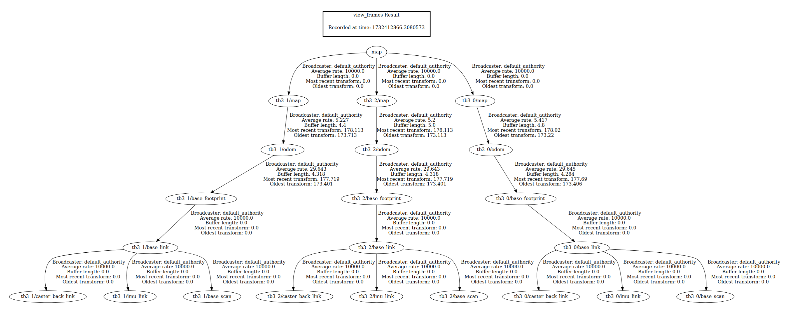

# ROS2 Voronoi Multi-Robot Exploration

> **⚠️ Work in Progress**  
> This setup is currently under active development. 

---

## Overview

This project aims to use a Voronoi-partition-based exploration algorithm to enable multiple robots to autonomously navigate and explore an environment.


---

## Requirements

- **ROS2 Humble**
- **TurtleBot Packages**
  - `turtlebot4` (for TurtleBot 4)
  - `turtlebot3` (for TurtleBot 3)

---

## Installation

Clone and build the workspace:

```bash
git clone https://github.com/akifbayram/ros2_voronoi.git
cd ~/ros2_voronoi
colcon build
```

---

## TurtleBot3 Simulation

1. **Launch Simulation and Map Merge Node**:

   This launch file starts a Gazebo simulation with a specified number of TurtleBot3 robots. Each robot runs its own SLAM Toolbox node and contributes to a unified merged map. It establishes static transforms from the global `map` frame to each robot’s namespace based on the robot_count parameter.

   ```bash
   cd ~/ros2_voronoi &&
   source install/setup.bash &&
   ros2 launch voronoi tb3.launch.py robot_count:=3
   ```

2. **Start Exploration**:
   ```bash
   cd ~/ros2_voronoi &&
   source install/setup.bash &&
   ros2 run voronoi voronoi_tb3 
   ```

   Alternatively, `ros2 run voronoi voronoi_tb3_frontier` can be used which utilizes frontier-based exploration with voronoi partitioning, closely aligning to the algorithm described in the research paper.

---

## Unitree Go2

1. **Launch go2_ros2_sdk**:

   Requires [`go2_ros2_sdk`](https://github.com/abizovnuralem/go2_ros2_sdk)
   
   ```bash
   cd ~/ros2_ws &&
   source install/setup.bash &&
   export ROBOT_IP="robot_ip" &&
   export CONN_TYPE="webrtc" &&
   ros2 launch go2_robot_sdk robot.launch.py
   ```

2. **Start launch script**:

   This launch file starts the `merge_map` node to merge the robot maps and establishes static transforms from the global merged map frame to each robot's individual namespace, based on the user-defined robot_count.

   ```bash
   cd ~/ros2_voronoi &&
   source install/setup.bash &&
   ros2 launch go2.launch.py
   ```

3. **Begin Exploration**:
   ```bash
   cd ~/ros2_voronoi
   source install/setup.bash &&
   ros2 run voronoi voronoi_go2 
   ```

---

## **Known Issues**

- **`voronoi_tb3`**:
   - Robots remain stationary after detecting an obstacle and fail to replan.
   - Robot namespace and count are hardcoded in the script.
   - Information nodes have not been implemented.
   - Does not explicitly consider communication range constraints when determining neighboring robots.

- **tb3.launch.py**
   - TODO: Utilize Nav2 instead of manual navigation.

- **`voronoi_go2`**: Untested

- **`tb4.launch.py`**: Users may experience intermittent issues with launching SLAM, Nav2, or RViz for additional TurtleBot4 units.

    - [Nav2 Stalling on Multiple Robots](https://github.com/ros-navigation/navigation2/issues/4350)
    - [SLAM with namespaced Robots](https://github.com/turtlebot/turtlebot4/issues/159)
    - [gazebo ignition simulation crashes when trying to simulate multiple turtlebot4 ](https://github.com/turtlebot/turtlebot4_simulator/issues/60)


## **Acknowledgments**

This project draws inspiration and code from the following repositories:

1. [**abdulkadrtr/ROS2-FrontierBaseExplorationForAutonomousRobot**](https://github.com/abdulkadrtr/ROS2-FrontierBaseExplorationForAutonomousRobot):  
   For path planning, following, obstacle avoidance, and frontier-based exploration.

2. [**abdulkadrtr/mapMergeForMultiRobotMapping-ROS2**](https://github.com/abdulkadrtr/mapMergeForMultiRobotMapping-ROS2):
   For multi robot map merging.

2. [**Connected-and-Autonomous-Systems-Lab/Voronoi**](https://github.com/Connected-and-Autonomous-Systems-Lab/voronoi):  
   Provides the Voronoi-based exploration algorithm used in this project.  
   - This repository is itself adapted from [**Peace1997/Voronoi_Based_Multi_Robot_Collaborate_Exploration_Unknow_Enviroment**](https://github.com/Peace1997/Voronoi_Based_Multi_Robot_Collaborate_Exploration_Unknow_Enviroment/tree/master)


## **Transform Tree**

The following transform tree is produced using the `tb3.launch.py` launch file. 

